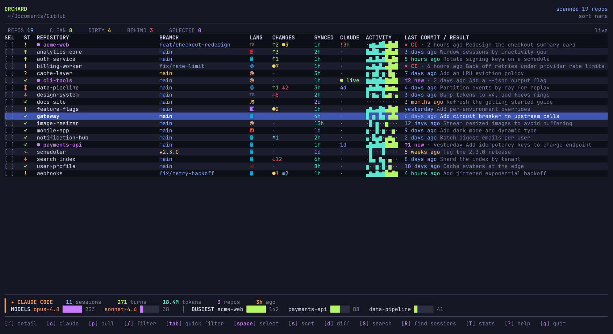

# 🌳 orchard

A keyboard-driven terminal dashboard for your local git repositories. See every repo's branch, dirty / ahead / behind state, language, and last commit on one screen, then pull, fetch, switch branches, search, or open them in your editor, browser, or Claude Code.

Built with [Bubble Tea](https://github.com/charmbracelet/bubbletea) and [Lipgloss](https://github.com/charmbracelet/lipgloss).



> Tip: run `orchard preview` to print one frame of the dashboard to stdout.

## Why orchard

Plenty of tools already show many git repos at once (`gita` and `mani` on the CLI; `gitpane`, `git-dash`, and `git-scope` as TUIs), and plenty of tools read your Claude Code transcripts for usage stats (`ccusage` and friends). orchard is the one that puts both in the same window: an interactive multi-repo git dashboard that also knows where you have been running Claude Code, launches it in any repo, and searches code across every repo at once.

If you juggle many repositories and lean on Claude Code, orchard is the cockpit for that workflow. If you only ever work in one repo at a time, a single-repo TUI like `lazygit` will serve you better.

## Features

- **One-screen overview** of every repo: branch, clean/dirty/ahead/behind/diverged/detached, uncommitted + stash counts, dominant language, last-synced and last-commit times (color-coded by freshness).
- **Safe bulk pull** - fast-forward only; skips dirty repos, detached HEADs, non-default branches, and repos with no upstream.
- **Fetch, branch switch, multi-select** - act on one repo or many at once.
- **Open anywhere** - launch your editor (`e`), the repo in your browser (`O`), or **Claude Code** (`c`) in a new terminal tab; multi-repo actions ask for confirmation first.
- **Cross-repo code search** (`S`) that respects `.gitignore`.
- **GitHub aware** - open PR count and CI status per repo (when a token is set), shown in the detail view, with a failing-CI flag on the dashboard.
- **Worklog** (`L`) - your own commits across all repos in a time window.
- **Clone** (`+`) a new repo into the dashboard, or `orchard clone` a scoped GitHub org.
- **Claude Code aware** - usage panel, a per-repo activity column, launch/resume/cross-repo sessions, and a flag for uncommitted AI work. See [Claude Code](#claude-code) below.
- **Scriptable CLI** - `scan`, `pull`, `clone` with `--json` for cron and pipelines.

## Claude Code

orchard treats Claude Code as a first-class part of a multi-repo workflow. Everything is read locally from your `~/.claude` transcripts; nothing is sent anywhere.

- **Usage panel** pinned under the list: total sessions, turns, repos used, last active, a model split, and your busiest repos.
- **Per-repo CLAUDE column**: how long ago Claude last ran in each repo, colored by recency.
- **Per-repo footprint in the detail view** (`enter`): that repo's recent sessions, total turns and tokens, and when Claude last ran there.
- **Uncommitted-work flag**: when a repo is dirty *and* Claude ran there recently, the CLAUDE cell turns red with a `!`, so AI edits never get lost in an unstaged tree.
- **Launch** (`c`): open Claude Code in a new terminal tab for the selected repo(s); multi-repo asks for confirmation.
- **Resume** (`C`): continue the most recent session in the current repo (`claude --continue`).
- **Session history** (`H`): browse a repo's past sessions by their titles (turn count, model, age) and resume any one (`claude --resume <id>`).
- **Draft a commit message** (`M`): Claude Code drafts a message from the working-tree diff *headlessly* (`claude -p`) and shows it in a window you can copy (`y`) or regenerate (`r`), without leaving the dashboard. Other assistants fall back to a terminal session.
- **Across repos** (`A`): one session spanning the selected repos, opened in the first with the rest attached via `--add-dir`, for cross-service work. `space`-select 2+ first.
- **Sort by Claude** (`s`): float the most recently Claude-worked repos to the top.
- **Usage**: per-repo token totals in the panel and session picker; `orchard stats` shows total sessions, turns, tokens, and a Claude activity heatmap alongside the commit harvest.
- **Adaptive**: launches `$ORCHARD_AI_CMD` if set, otherwise the first of `claude` or `copilot` found on your `PATH`.

## Requirements

- **Platforms:** macOS and Linux (amd64/arm64). Windows is not supported yet.
- **Build:** Go **1.24+**.
- **Runtime:** `git` on your `PATH`.
- **Optional:**
  - A [Nerd Font](https://www.nerdfonts.com/) for the icons (any other monospace font works; icons just render as boxes).
  - [`gh`](https://cli.github.com/) (GitHub CLI) - used by `orchard clone --org` for auth if `GITHUB_TOKEN` isn't set.
  - [`claude`](https://claude.com/claude-code) - for the `c` key (launch Claude Code) and the usage panel.
  - A supported terminal for new-tab launches: Ghostty, iTerm2, WezTerm, tmux, or macOS Terminal (otherwise it falls back to running in place).

## Install

### Download a release (no Go required)

Grab the archive for your OS/arch from the [**Releases**](https://github.com/prakashkurup/orchard/releases) page, extract it, and move the `orchard` binary onto your `PATH`:

```sh
# e.g. macOS Apple Silicon - adjust the filename for your OS/arch
tar -xzf orchard_*_darwin_arm64.tar.gz
sudo mv orchard /usr/local/bin/
orchard version
```

On macOS the binary is unsigned, so the first launch may be blocked by Gatekeeper. Allow it once with:

```sh
xattr -d com.apple.quarantine /usr/local/bin/orchard    # or right-click → Open
```

### go install (needs the Go toolchain)

```sh
go install github.com/prakashkurup/orchard@latest
```

### From source

```sh
git clone https://github.com/prakashkurup/orchard.git
cd orchard
make build       # produces ./orchard (version stamped from git tags)
make install     # installs into $(go env GOPATH)/bin
```

## Quick start

```sh
orchard                               # launch the TUI for the configured root
orchard --root ~/Documents/GitHub     # or point it at any folder
orchard preview                       # render one dashboard frame to stdout
orchard scan --root ~/code --json     # machine-readable status of every repo
orchard pull --root ~/code --all      # fast-forward every eligible repo
```

`orchard` scans **one root folder** and treats each immediate subdirectory that contains a `.git` as a repository. (If the root itself is a repo, it shows just that one.)

## TUI keys

| Key | Action |
|-----|--------|
| `↑ ↓` / `j k` | move · `g` / `G` top / bottom |
| `n` | jump to next repo with new commits since last visit |
| `space` / `a` | select current / select all visible |
| `x` | clear all selections |
| `enter` | repo detail (status, commit graph, remotes, languages) |
| `d` | view the working-tree diff (vs HEAD) |
| `p` / `P` | pull selected / all (fast-forward only) |
| `f` / `F` | fetch selected / all |
| `b` | switch branch |
| `c` | open Claude Code in a new tab (confirms for >1 repo) |
| `C` | resume the last Claude Code session in the current repo |
| `H` | browse past Claude Code sessions for the current repo and resume any one |
| `A` | one Claude Code session across the selected repos: opens in the first selected, the rest attached via `--add-dir` (`space`-select 2+ first) |
| `M` | draft a commit message (Claude Code drafts it in a window to copy / regenerate) |
| `e` / `E` | open in editor / change default editor |
| `O` | open repo(s) in browser (confirms for >1 repo) |
| `S` | search code across all repos |
| `L` | worklog - your commits across repos |
| `T` | stats page (languages, freshest/thirstiest, Claude usage, harvest + Claude heatmaps) |
| `+` | clone a repo into the dashboard |
| `/` | filter by name · `tab` cycle quick filters |
| `s` / `o` | cycle sort (attention / name / synced / claude) / toggle grouping |
| `r` / `w` | refresh now / toggle live auto-refresh |
| `?` / `q` | help & legend / quit |

## CLI

```
orchard [--config PATH]                  start the TUI
orchard [--config PATH] scan    [flags]  print repo status
orchard [--config PATH] pull    [flags]  fast-forward eligible repos
orchard [--config PATH] clone   [flags]  clone scoped GitHub org repos
orchard [--config PATH] preview [flags]  render the dashboard once
orchard [--config PATH] config           show resolved configuration
orchard [--config PATH] stats            summarize the orchard (languages, harvest)
orchard version                          print the version
orchard help
```

Common flags: `--root PATH`, `--concurrency N`, `--json`. Run `orchard <cmd> -h` for per-command flags.

- `scan` - `--root`, `--concurrency`, `--json`
- `pull` - `--all` **or** `--match RE`, `--root`, `--concurrency`, `--json`
- `clone` - `--org` and `--match RE` (both required, so you never clone a whole org by accident), `--include-archived`, `--root`, `--concurrency`, `--json`
- `preview` - `--width`, `--height`, `--group`, `--detail NAME`

## Configuration

All settings are optional. **Precedence:** CLI flags → environment variables → config file → built-in defaults.

**Environment variables**

- `ORCHARD_ROOT` - default repo folder.
- `ORCHARD_CONFIG` - explicit config file path.
- `GITHUB_TOKEN` - token for `orchard clone` (falls back to `gh auth token`).

**Config file** is a small `key: value` format with one nested `scope:` section. Copy [`config.example.yaml`](config.example.yaml) to `config.yaml`. Search order: `--config` → `$ORCHARD_CONFIG` → `./config.yaml` → next to the binary → `$XDG_CONFIG_HOME/orchard/config.yaml`.

```yaml
root: ~/Documents/GitHub
concurrency: 8
org: your-github-org
scope:
  match: "^(service|app)-"
```

## Security & privacy

orchard runs locally with no telemetry. Network traffic only happens when you ask for it:

- `git` talking to your remotes (fetch / pull / clone).
- the **GitHub API** for open-PR and CI status, and for `orchard clone`.
- **Claude Code**, when you launch it (`c` / `C` / `H` / `A`) or draft a commit message (`M`, which runs `claude -p` and sends the working-tree diff to Claude). The usage panel, CLAUDE column, and stats only **read** your local `~/.claude` transcripts - nothing is sent for those.

Privacy details:

- The GitHub token is read from `GITHUB_TOKEN` or `gh auth token` at the moment it's needed; it is **never written to disk or printed**, and tokens embedded in a remote URL are stripped before the URL is shown or opened.
- Pulls are **fast-forward only** and skip dirty repos - orchard never force-pushes, rebases, or discards work, and it never commits or pushes on your behalf.

See [SECURITY.md](SECURITY.md) for how to report a vulnerability.

## Development

```sh
make build       # build ./orchard
make test        # run the test suite
make test-race   # tests with the race detector
make lint        # gofmt check + go vet
make check       # lint + test (run before committing)
make cover       # HTML coverage report
make help        # list all targets
```

The codebase is split into small packages under `internal/` (`tui`, `git`, `github`, `repo`, `config`, `editor`, `lang`, `search`, `seen`, `termlaunch`, `claude`) with a thin `main.go` CLI. The logic lives in the unit-tested packages; the TUI is a Bubble Tea layer on top.

### Cutting a release

Releases are automated with [GoReleaser](https://goreleaser.com/). Tag a commit and push the tag - the `release` workflow builds binaries for macOS and Linux (amd64 + arm64) and publishes them:

```sh
git tag v0.1.0
git push origin v0.1.0
```

## Contributing

Issues and PRs are welcome. Please run `make check` before submitting. See [CONTRIBUTING.md](CONTRIBUTING.md).

## License

[MIT](LICENSE)
